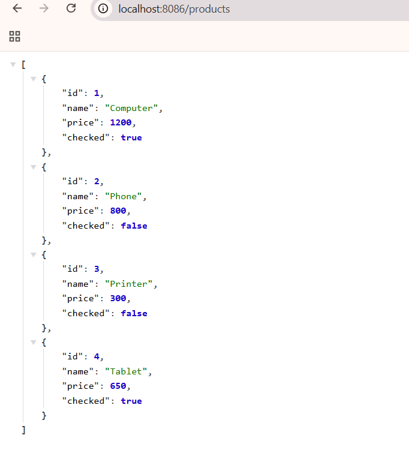

# Université : ENSET Mohammedia

## Module : les concepts de base de Angular

### Réalisé par : Bouchra RAFIK
### Encadré par : Mr.Mohamed YOUSSFI


# Product Manager — Angular 22 + Spring Boot 3

Application CRUD complète de gestion de produits, construite avec **Angular 22** (frontend) et **Spring Boot 3** (backend REST).

---

## Fonctionnalités

| Fonctionnalité | Description |
|---|---|
| **Affichage** | Liste paginée de tous les produits |
| **Recherche** | Filtrage des produits par nom (en temps réel) |
| **Pagination** | Navigation entre les pages (taille configurable) |
| **Ajouter** | Formulaire de création d'un nouveau produit |
| **Modifier** | Formulaire d'édition d'un produit existant |
| **Supprimer** | Suppression avec confirmation |
| **Cocher/Décocher** | Basculement de l'état `checked` d'un produit |
| **Dashboard** | Statistiques en temps réel (total, pages, cochés) |
| **Indicateur de chargement** | Spinner HTTP automatique via intercepteur |
| **Gestion des erreurs** | Affichage des erreurs API dans l'interface |

---

## Technologies utilisées

### Frontend
| Technologie | Version |
|---|---|
| Angular | 22 |
| TypeScript | 6 |
| Bootstrap | 5.3 |
| Bootstrap Icons | 1.11 |
| RxJS | 7.8 |

### Backend
| Technologie | Version |
|---|---|
| Java | 17 |
| Spring Boot | 3.3 |
| Spring Data JPA | 3.3 |
| Hibernate | 6 |
| H2 Database | (in-memory) |
| Maven | 3.x |

---

## Architecture

```
Client Angular (port 4200)
        │
        │  HTTP (GET / POST / PUT / PATCH / DELETE)
        ▼
Spring Boot REST API (port 8086)
        │
        │  Spring Data JPA
        ▼
H2 In-Memory Database
```

**Modules Angular :**
- **Pages** : `home`, `products`, `new-product`, `edit-product`
- **Shared** : `navbar`, `dashboard`, `app-errors`
- **Services** : `ProductService`, `AppStateService`, `LoadingService`
- **Intercepteur HTTP** : `appHttpInterceptor` (spinner + en-tête `Authorization`)

---

## Structure du projet

```
TP4_Angular Framework/
│
├── backend/                                 ← API Spring Boot
│   ├── pom.xml
│   └── src/main/
│       ├── java/ma/rafik/productapp/
│       │   ├── ProductAppApplication.java
│       │   ├── config/
│       │   │   └── WebConfig.java           ← CORS global
│       │   ├── controller/
│       │   │   └── ProductController.java   ← Endpoints REST
│       │   ├── model/
│       │   │   └── Product.java             ← Entité JPA
│       │   └── repository/
│       │       └── ProductRepository.java   ← Spring Data JPA
│       └── resources/
│           ├── application.properties
│           └── data.sql                     ← Données initiales
│
└── AngularApprentissage/                    ← Application Angular
    ├── screenshots/                         ← Captures d'écran
    ├── public/
    └── src/app/
        ├── models/
        │   └── product.model.ts
        ├── services/
        │   ├── product.service.ts
        │   ├── app-state.service.ts
        │   ├── loading.service.ts
        │   └── app-http.interceptor.ts
        ├── pages/
        │   ├── home/
        │   ├── products/
        │   ├── new-product/
        │   └── edit-product/
        ├── shared/
        │   ├── navbar/
        │   ├── dashboard/
        │   └── app-errors/
        ├── app.component.*
        ├── app-routing.module.ts
        └── app.module.ts
```

---

## Installation

### Prérequis

| Outil | Version minimale |
|---|---|
| Java JDK | 17 |
| Maven | 3.6 |
| Node.js | 18 |
| npm | 9 |
| Angular CLI | `npm install -g @angular/cli` |

### Cloner le projet

```bash
git clone <url-du-dépôt>
cd "TP4_Angular Framework"
```

---

## Lancement du backend

```bash
cd backend
mvn spring-boot:run
```

L'API démarre sur **http://localhost:8086**

> La base de données H2 est en mémoire et se remplit automatiquement depuis `data.sql` au démarrage.  
> Console H2 (optionnelle) : http://localhost:8086/h2-console — JDBC URL : `jdbc:h2:mem:productdb`

### Résultat dans le terminal


---

## Lancement du frontend

```bash
cd AngularApprentissage
npm install
ng serve
```

L'application est accessible sur **http://localhost:4200**

> Le backend doit être démarré avant le frontend.

### Résultat dans le terminal


---

## API REST

| Méthode | Endpoint | Description |
|---|---|---|
| `GET` | `/products?name_like=&_page=1&_limit=4` | Liste paginée avec filtre |
| `GET` | `/products/{id}` | Détail d'un produit |
| `POST` | `/products` | Créer un produit |
| `PUT` | `/products/{id}` | Mettre à jour un produit |
| `PATCH` | `/products/{id}` | Modifier partiellement (ex: `checked`) |
| `DELETE` | `/products/{id}` | Supprimer un produit |

### Exemple de réponse `GET /products`

```json
[
  { "id": 1, "name": "Computer",  "price": 1200.0, "checked": true  },
  { "id": 2, "name": "Phone",     "price":  800.0, "checked": false },
  { "id": 3, "name": "Printer",   "price":  300.0, "checked": false }
]
```

**En-tête de réponse :** `X-Total-Count: 12` ← utilisé par Angular pour calculer le nombre de pages.

### Réponse réelle dans le navigateur



---

## Captures d'écran

### 1 — Page d'accueil


### 2 — Liste des produits


### 3 — GET (lecture des produits via API)


### 4 — DELETE (suppression d'un produit)


### 5 — GET après suppression


### 6 — PUT (modification d'un produit)


### 7 — GET après modification


---

## Modèle de données

```typescript
// Angular — product.model.ts
export interface Product {
  id: number;
  name: string;
  price: number;
  checked: boolean;
}
```

```java
// Spring Boot — Product.java
@Entity
public class Product {
    @Id @GeneratedValue(strategy = GenerationType.IDENTITY)
    private Long id;
    private String name;
    private double price;
    private boolean checked;
}
```

---

## Conclusion

Ce projet démontre une architecture **full-stack professionnelle** combinant :

- Un **frontend Angular 22** organisé en couches (pages, shared, services, models)  
- Un **backend Spring Boot 3** avec API REST paginée et CORS configuré  
- Une **base H2 in-memory** pré-remplie pour les démonstrations  
- Un **intercepteur HTTP** pour la gestion centralisée du spinner de chargement  
- Un **AppStateService** pour la gestion de l'état global de l'application  

Le projet est prêt à être cloné, exécuté et étendu.

---

*Développé par **Bouchra Rafik** — Angular 22 + Spring Boot 3 — 2025*
