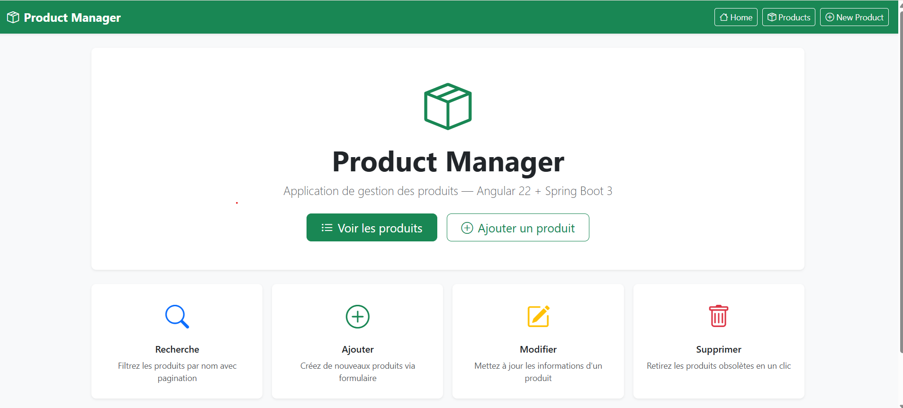
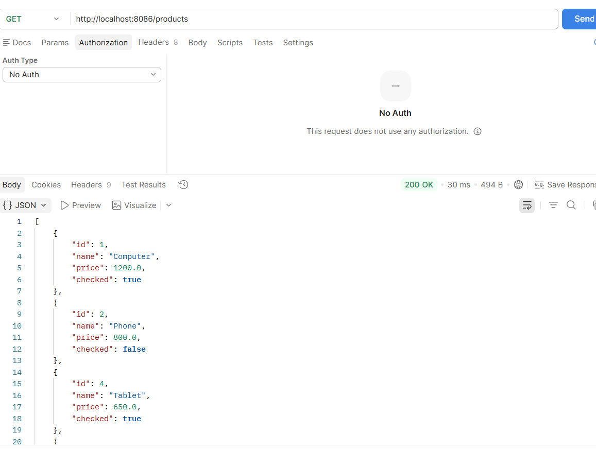
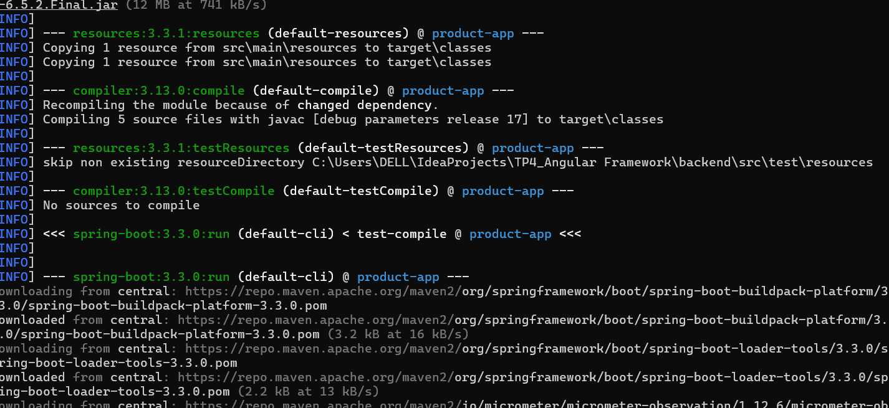
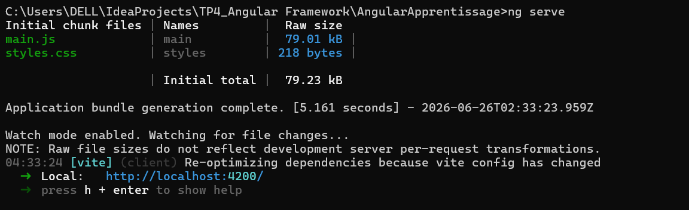
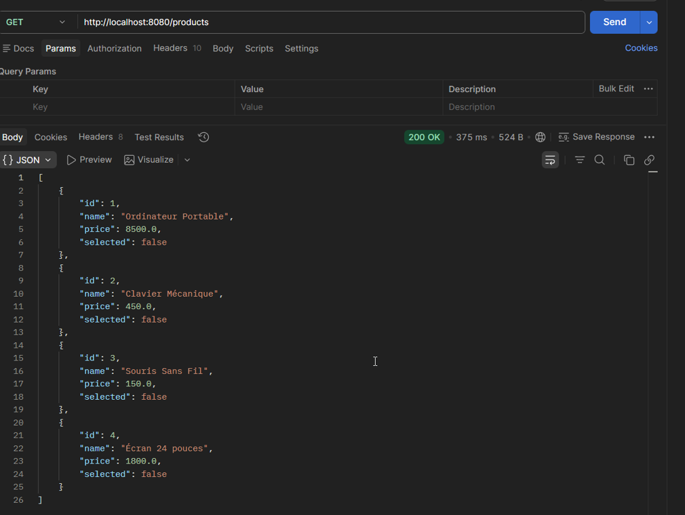
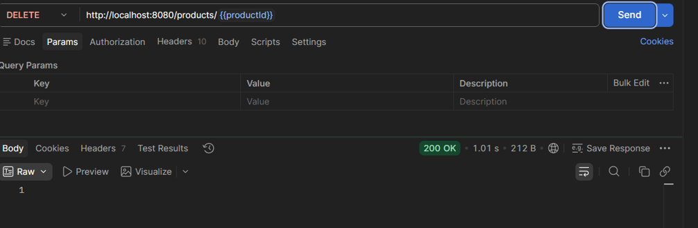
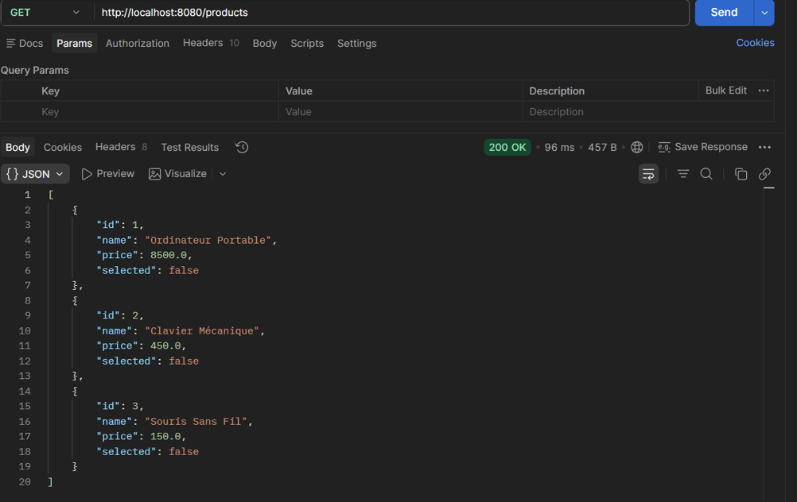
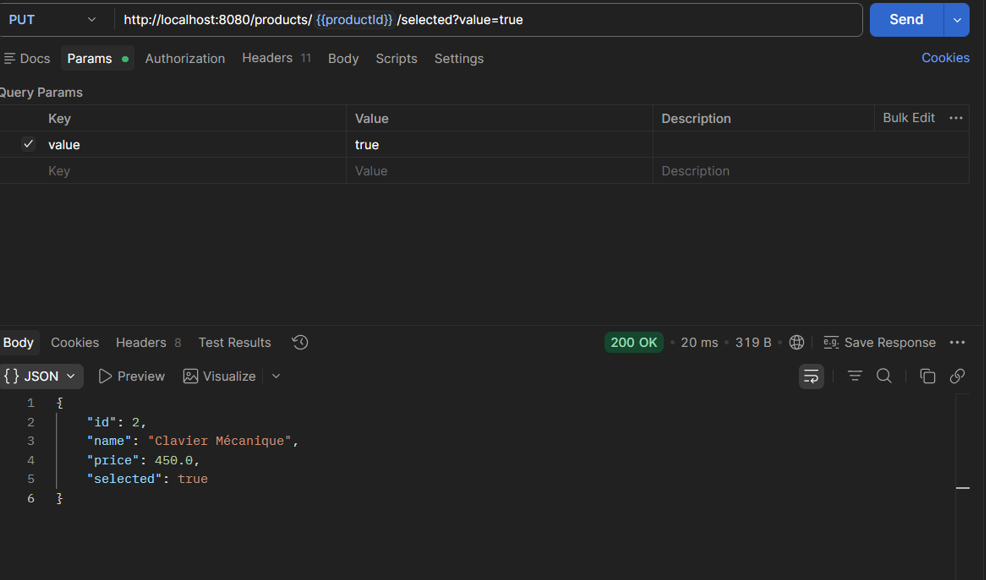
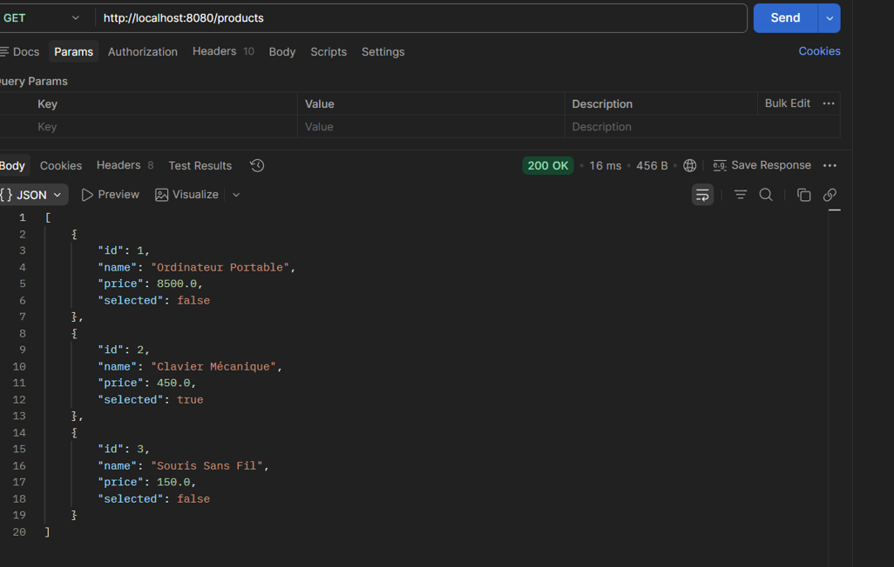

# Université : ENSET Mohammedia

**Module :** "Concepts de base de Angular"  
**Réalisé par :** Bouchra RAFIK  
**Encadré par :** M. Mohamed YOUSSFI  
**Année universitaire :** 2025 – 2026

---

# Product Manager — Angular 22 + Spring Boot 3

Application CRUD complète de gestion de produits, construite avec **Angular 22** (frontend) et **Spring Boot 3** (backend REST).

---

## Fonctionnalités

| Fonctionnalité | Description |
|---|---|
| **Affichage** | Liste paginée de tous les produits |
| **Recherche** | Filtrage des produits par nom en temps réel |
| **Pagination** | Navigation entre les pages (taille configurable) |
| **Ajouter** | Formulaire de création d'un nouveau produit |
| **Modifier** | Formulaire d'édition d'un produit existant |
| **Supprimer** | Suppression avec confirmation |
| **Cocher / Décocher** | Basculement de l'état `checked` d'un produit |
| **Dashboard** | Statistiques en temps réel (total, pages, cochés) |
| **Indicateur de chargement** | Spinner HTTP automatique via intercepteur |
| **Gestion des erreurs** | Affichage des erreurs API dans l'interface |

---

## Aperçu de l'interface

La page d'accueil illustre la mise en place du routing Angular et la composition du composant partagé `navbar`.
J'ai appris à structurer une application Angular en pages indépendantes reliées par `AppRoutingModule`.



La page produits affiche le tableau CRUD complet : barre de recherche, résultats paginés et actions (modifier, supprimer, cocher).
J'ai maîtrisé les directives `*ngFor` / `*ngIf`, la liaison de données bidirectionnelle et l'intégration du `ProductService`.



---

## Technologies utilisées

### Frontend

| Technologie | Version |
|---|---|
| Angular | 22 |
| TypeScript | 6.0 |
| Bootstrap | 5.3 |
| Bootstrap Icons | 1.11 |
| RxJS | 7.8 |

### Backend

| Technologie | Version |
|---|---|
| Java | 17 |
| Spring Boot | 3.3 |
| Spring Data JPA | 3.3 |
| Hibernate | 6 |
| H2 Database | in-memory |
| Maven | 3.x |

---

## Architecture

```
Client Angular (port 4200)
        │
        │  HTTP (GET / POST / PUT / PATCH / DELETE)
        ▼
Spring Boot REST API (port 8086)
        │
        │  Spring Data JPA
        ▼
H2 In-Memory Database
```

**Modules Angular :**
- **Pages** : `home`, `products`, `new-product`, `edit-product`
- **Shared** : `navbar`, `dashboard`, `app-errors`
- **Services** : `ProductService`, `AppStateService`, `LoadingService`
- **Intercepteur HTTP** : `appHttpInterceptor` (spinner + en-tête `Authorization`)

---

## Structure du projet

```
TP4_Angular Framework/
│
├── backend/                                 ← API Spring Boot
│   ├── pom.xml
│   └── src/main/
│       ├── java/ma/rafik/productapp/
│       │   ├── ProductAppApplication.java
│       │   ├── config/
│       │   │   └── WebConfig.java           ← CORS global
│       │   ├── controller/
│       │   │   └── ProductController.java   ← Endpoints REST
│       │   ├── model/
│       │   │   └── Product.java             ← Entité JPA
│       │   └── repository/
│       │       └── ProductRepository.java   ← Spring Data JPA
│       └── resources/
│           ├── application.properties
│           └── data.sql                     ← Données initiales
│
└── AngularApprentissage/                    ← Application Angular
    ├── screenshots/                         ← Captures d'écran
    ├── public/
    └── src/app/
        ├── models/
        │   └── product.model.ts
        ├── services/
        │   ├── product.service.ts
        │   ├── app-state.service.ts
        │   ├── loading.service.ts
        │   └── app-http.interceptor.ts
        ├── pages/
        │   ├── home/
        │   ├── products/
        │   ├── new-product/
        │   └── edit-product/
        ├── shared/
        │   ├── navbar/
        │   ├── dashboard/
        │   └── app-errors/
        ├── app.component.*
        ├── app-routing.module.ts
        └── app.module.ts
```

---

## Installation

### Prérequis

| Outil | Version minimale |
|---|---|
| Java JDK | 17 |
| Maven | 3.6 |
| Node.js | 18 |
| npm | 9 |
| Angular CLI | `npm install -g @angular/cli` |

### Cloner le projet

```bash
git clone <url-du-dépôt>
cd "TP4_Angular Framework"
```

---

## Lancement du backend

```bash
cd backend
mvn spring-boot:run
```

L'API démarre sur **http://localhost:8086**

> La base de données H2 est en mémoire et se remplit automatiquement depuis `data.sql` au démarrage.  
> Console H2 (optionnelle) : `http://localhost:8086/h2-console` — JDBC URL : `jdbc:h2:mem:productdb`

Ce terminal montre le démarrage complet de Spring Boot : initialisation de la base H2, exécution de `data.sql` et lancement de Tomcat sur le port 8086.
J'ai appris à configurer CORS (`WebConfig.java`) et à exploiter une base H2 en mémoire pour le développement.



---

## Lancement du frontend

```bash
cd AngularApprentissage
npm install
ng serve
```

L'application est accessible sur **http://localhost:4200**

> Le backend doit être démarré avant le frontend.

Ce terminal montre la compilation réussie par Angular CLI : transpilation TypeScript, génération des bundles et démarrage du serveur de développement avec rechargement automatique.
J'ai compris le cycle de build Angular 22 et le rôle de `angular.json`.



---

## API REST

| Méthode | Endpoint | Description |
|---|---|---|
| `GET` | `/products?name_like=&_page=1&_limit=4` | Liste paginée avec filtre |
| `GET` | `/products/{id}` | Détail d'un produit |
| `POST` | `/products` | Créer un produit |
| `PUT` | `/products/{id}` | Mettre à jour un produit |
| `PATCH` | `/products/{id}` | Modifier partiellement (ex : `checked`) |
| `DELETE` | `/products/{id}` | Supprimer un produit |

### Exemple de réponse `GET /products`

```json
[
  { "id": 1, "name": "Computer", "price": 1200.0, "checked": true  },
  { "id": 2, "name": "Phone",    "price":  800.0, "checked": false },
  { "id": 3, "name": "Printer",  "price":  300.0, "checked": false }
]
```

**En-tête de réponse :** `X-Total-Count: 12` — utilisé par Angular pour calculer le nombre de pages.

---

### Réponse GET en direct depuis le navigateur

La réponse JSON confirme que le backend est opérationnel et que la sérialisation JPA fonctionne : structure des objets (`id`, `name`, `price`, `checked`) et en-tête `X-Total-Count` pour la pagination côté Angular.
J'ai validé ici le bon fonctionnement des endpoints REST avant d'intégrer `HttpClient`.


---

### Démonstration des opérations CRUD

#### Lecture — GET /products

Cette capture montre la réponse complète de `GET /products` dans les outils de développement du navigateur, avec la liste des produits au format JSON.
J'ai compris comment `HttpClient` consomme l'API et mappe les données vers des objets TypeScript typés.



---

#### Suppression — DELETE /products/{id}

La requête `DELETE /products/{id}` en action confirme la suppression de la ressource via le code de statut HTTP retourné.
J'ai appris à déclencher un DELETE depuis Angular et à rafraîchir la liste immédiatement après.



---

#### GET après suppression

Ce second `GET /products` confirme que le produit supprimé a disparu de la liste, illustrant le cycle : action → appel API → mise à jour de l'état via `AppStateService`.
J'ai compris l'importance de synchroniser l'état Angular avec la réalité côté serveur.



---

#### Modification — PUT /products/{id}

La requête `PUT /products/{id}` transmet le corps JSON complet des données modifiées au backend.
J'ai appris à construire des formulaires réactifs (`ReactiveFormsModule`), à pré-remplir les champs depuis `GET /products/{id}` et à soumettre via `HttpClient`.



---

#### GET après modification

La liste après modification confirme que les nouvelles valeurs (`name`, `price`) ont été correctement persistées côté backend.
J'ai validé le cycle complet `Edit → PUT → GET` et la cohérence des données entre Angular 22 et Spring Boot.



---

## Modèle de données

```typescript
// Angular — product.model.ts
export interface Product {
  id: number;
  name: string;
  price: number;
  checked: boolean;
}
```

```java
// Spring Boot — Product.java
@Entity
public class Product {
    @Id @GeneratedValue(strategy = GenerationType.IDENTITY)
    private Long id;
    private String name;
    private double price;
    private boolean checked;
}
```

---

## Conclusion

Ce projet démontre une architecture **full-stack** combinant :

- Un **frontend Angular 22** organisé en couches (pages, shared, services, models)
- Un **backend Spring Boot 3** avec API REST paginée et CORS configuré
- Une **base H2 in-memory** pré-remplie pour les démonstrations
- Un **intercepteur HTTP** pour la gestion centralisée du spinner de chargement
- Un **`AppStateService`** pour la gestion de l'état global de l'application

La réalisation de ce TP m'a permis de maîtriser les fondamentaux d'Angular 22 (composants, services, routing, formulaires réactifs, `HttpClient`) en les appliquant sur un cas concret d'API REST Spring Boot. Le projet est prêt à être cloné, exécuté et étendu.

---

*Développé par **Bouchra Rafik** — Angular 22 + Spring Boot 3 — Année 2025–2026*
